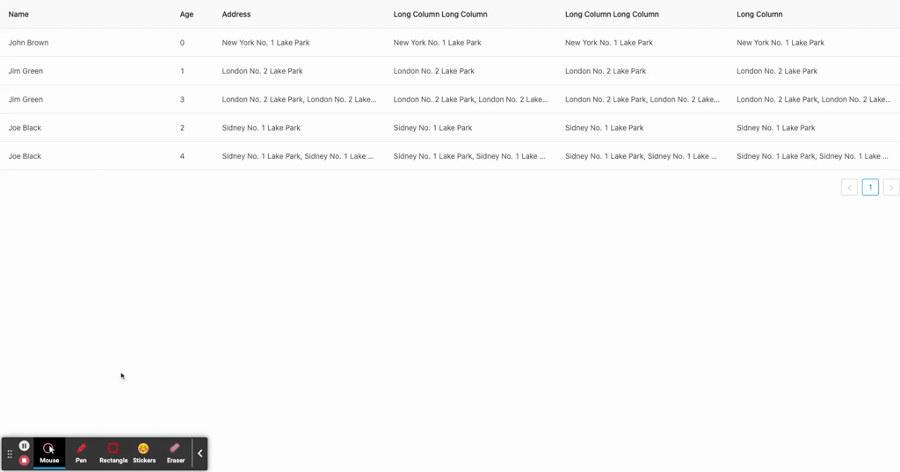

# drap-table

_基于 antdv 组件库的 a-table 实现_
_实现对 a-table 拖拽排序_



## 运行 demo

```
yarn install
yarn serve
```

### 使用

```
<drap-table {...attrs}></drap-table>
```

参数 attrs 与 a-table 一致

### 更新

-   可以实现嵌套拖拽（即可以包含嵌套内容）

### TODO

-   由于 ATable 组件在挂载时，并不会生成嵌套内容 DOM，transitionGroup 无法获取 DOM 元素（VNode 与 DOM 数量不一致）
-   目前实现，先将全部内容展开，使 ATable 生成嵌套内容 DOM，挂载后再将全部嵌套内容隐藏
-   transitionGroup 就能获取真正的 DOM 元素了
